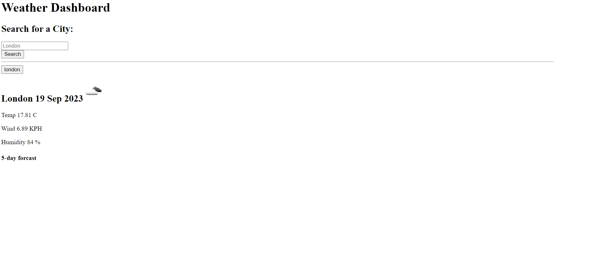

# Weather-Dashboard
Creating a weather application with a 5-day forecast, incl. wind, temperature and humidity for any city

# Description

I have been given a starter code with a html file with the necessary elements.
Using the starter code, I have used javascript and jQuery logic to do the following:

- Create a weather dashboard with form inputs.

- When a user searches for a city they are presented with current and future conditions for that city and that city is added to the search history.

- When a user views the current weather conditions for that city they are presented with:

    The city name

    The date

    An icon representation of weather conditions

    The temperature

    The humidity

    The wind speed

- When a user views future weather conditions for that city they are presented with a 5-day forecast that displays:

    The date

    An icon representation of weather conditions

    The temperature

    The humidity

- When a user clicks on a city in the search history they are again presented with current and future conditions for that city.

Please check the index.js to see the source code
Please check the Deployed Application (https://saycatnab.github.io/Weather-Dashboard/) to see the console.

# Screenshots

This is how the Financial Analysis looks in the console

# Link to Deployed Applications

https://saycatnab.github.io/Weather-Dashboard/
